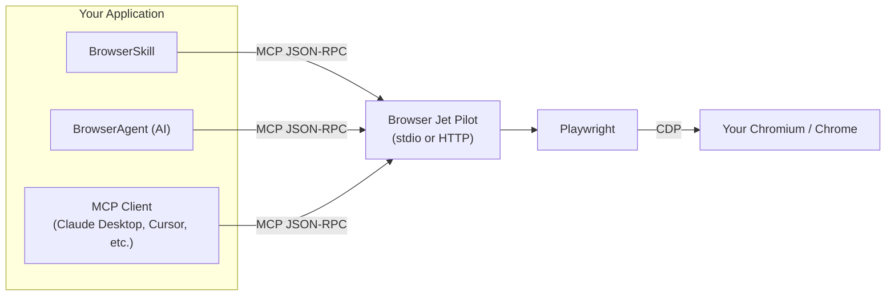

# Browser Jet Pilot

[](https://github.com/0xABADBABE-ops/browser-jet-pilot/actions/workflows/ci.yml)

**Self-hosted MCP server for AI browser automation. Drop-in @browserbasehq/mcp alternative.**

## What's New

### v1.0.0 — Base Release

- **API Key Authentication** — Secure your HTTP transport with API key authentication using the `API_KEY` environment variable and `X-API-Key` header
- **Testing Infrastructure** — Comprehensive test suite powered by Vitest with coverage reports and UI mode
- **Developer Experience** — ESLint, Prettier, and pre-commit hooks (Husky + lint-staged) for consistent code quality
- **Enhanced Security** — Constant-time API key comparison using `crypto.timingSafeEqual` to prevent timing attacks
- **Improved CI/CD** — Extended workflow with type checking, linting, testing, and security audits
- **Bug Fixes** — Fixed SVG/MathML element handling in content extraction, proper browser cleanup on session end, and enhanced type safety

### New Tools

- **`browser_disable_shaders`** — Block WebGL, freeze CSS animations, and throttle `requestAnimationFrame` to ~1 FPS for heavy shader-rendered pages
- **`browser_restore_shaders`** — Restore shader operations (WebGL/RAF require page reload to fully restore)

## Description

Self-hosted MCP server for browser automation. Connect to your own Chromium instance via CDP — no Browserbase subscription needed.

Drop-in alternative to `@browserbasehq/mcp` that runs on your infrastructure.

## Features

- **Connect to existing browser** via Chrome DevTools Protocol (CDP)
- **Or launch a new one** managed by Playwright
- **19 deterministic tools** — no LLM needed for basic browser control (including shader control tools)
- **MCP stdio transport** — works with Claude Desktop, Cursor, or any MCP client
- **MCP HTTP transport** — expose as a service on a port with optional API key authentication
- **BrowserAgent** — AI-powered autonomous browser agent (OpenAI, Anthropic, or custom)
- **BrowserSkill** — standardized skill interface for agent frameworks
- **Tab management** — multi-tab workflows
- **Screenshot support** — base64 PNG output, element or full-page
- **Comprehensive testing** — Vitest test suite with coverage and UI
- **Developer tooling** — ESLint, Prettier, pre-commit hooks

## A little notice

I want you to understand that this repository contains a highly powerful toolset—exceptionally powerful.

It is shared in good faith, with the expectation that you will use these tools responsibly and for educational purposes, without causing harm to others. There are no guardrails, restrictions, or feature flags built in that would limit or alter their original capabilities.

As the saying goes, _a weapon is only as dangerous as the hands that wield it._ Power itself is neutral—its consequences are defined entirely by the intent and discipline of the user.

I won’t go into detail about what could go wrong or the many ways these tools might be misused. If you found this repository while looking for **that**, you likely already know what you’re doing—and I won’t be the one to outline those paths. Instead, in the next part of this document, you’ll find guidance on how you **should** use these tools, along with the valuable and practical functionality they were designed to provide.

Keep in mind: these tools possess an extraordinary level of power, and that power is entirely in your hands.

If any damage occurs—whether through data leaks, automated actions, replay mechanisms, or otherwise—responsibility does not lie with the tools or this project. The sole accountable party is you. ¯\_(ツ)\_/¯

## Quick Start

### 1. Have a browser running with CDP

```bash
# If using Xvfb + Chromium:
chromium --no-sandbox --remote-debugging-port=9222 --disable-gpu

# Or just connect to your existing VNC Chromium (make sure it has --remote-debugging-port=9222)
```

### 2. Install and run

```bash
npm install
npm run build

# Stdio mode (for Claude Desktop, etc.)
node dist/index.js

# HTTP mode
node dist/index.js --port 3100
```

### 3. Configure Claude Desktop

Add to your `claude_desktop_config.json`:

**Config file locations by platform:**

- **macOS**: `~/Library/Application Support/Claude/claude_desktop_config.json`
- **Windows**: `%APPDATA%\Claude\claude_desktop_config.json`
- **Linux**: `~/.config/Claude/claude_desktop_config.json`

```json
{
  "mcpServers": {
    "browser": {
      "command": "node",
      "args": ["/absolute/path/to/dist/index.js"],
      "env": {
        "CDP_URL": "http://localhost:9222"
      }
    }
  }
}
```

## Documentation site (Mintlify)

Project docs are now available in `docs/` (Mintlify format).

```bash
# Install dependencies (includes Mint CLI as dev dependency)
npm install

# Validate docs build
npm run docs:validate

# Check internal links
npm run docs:links

# Run docs locally
npm run docs:dev
```

## Continuous integration

GitHub Actions workflow is available at `.github/workflows/ci.yml`.

It runs on every push and pull request, and executes:

- `npm ci`
- `npm run build`
- `npm run typecheck`
- `npm run lint`
- `npm run test -- --run`
- `npm audit --audit-level=moderate`
- `npm run docs:validate`
- `npm run docs:links`
- Docker Compose startup + health wait
- `npm run reliability:check`

## Development

### Available Scripts

| Command                     | Description                        |
| --------------------------- | ---------------------------------- |
| `npm run build`             | Compile TypeScript to `dist/`      |
| `npm run dev`               | Run in development mode with `tsx` |
| `npm start`                 | Run the built server               |
| `npm run agent`             | Run BrowserAgent CLI               |
| `npm run agent:seq`         | Run deterministic tool sequence    |
| `npm run test`              | Run Vitest test suite              |
| `npm run test:coverage`     | Run tests with coverage report     |
| `npm run test:ui`           | Run Vitest UI interface            |
| `npm run lint`              | Run ESLint                         |
| `npm run lint:fix`          | Fix ESLint issues automatically    |
| `npm run format`            | Format code with Prettier          |
| `npm run format:check`      | Check code formatting              |
| `npm run reliability:check` | Run full reliability test suite    |

### Pre-commit Hooks

The project uses Husky and lint-staged to ensure code quality:

- TypeScript/TSX files: ESLint + Prettier
- JSON, Markdown, YAML: Prettier

Install hooks after cloning:

```bash
npm install
```

The `prepare` script in `package.json` automatically sets up Husky.

## Run with Docker

### Quick start (Docker Compose)

```bash
docker compose up -d --build
docker compose ps
curl http://localhost:3100/healthz
```

Expected:

- MCP endpoint: `http://localhost:3100/mcp`
- Health endpoint: `http://localhost:3100/healthz`
- Container status: `healthy` (`docker compose ps`)

Quick smoke test (tool flow):

```bash
npm run agent -- --server-url http://localhost:3100/mcp --sequence \
  browser_start "browser_navigate?url=https://example.com" \
  "browser_get_content?selector=body&type=text" browser_end
```

> First image build takes longer because Playwright Chromium binaries are installed in-container.
> Compose includes a built-in healthcheck against `/healthz`.

Thorough reliability pass (health + lifecycle + extraction + multi-tab + 5x repeat):

```bash
npm run reliability:check
# or against a custom endpoint:
npm run reliability:check -- http://localhost:3100/mcp
```

### Stop

```bash
docker compose down
```

### Option B: Plain Docker (no Compose)

```bash
docker build -t browser-jet-pilot:local .
docker run --rm -p 3100:3100 --shm-size=1g \
  -e PORT=3100 -e HOST=0.0.0.0 -e LAUNCH=true \
  browser-jet-pilot:local
```

### External Chromium (CDP mode)

```bash
docker run --rm -p 3100:3100 --shm-size=1g \
  -e PORT=3100 -e HOST=0.0.0.0 -e LAUNCH=false \
  -e CDP_URL=http://host.docker.internal:9222 \
  browser-jet-pilot:local
```

If `host.docker.internal` is not available on your Linux Docker setup, add:

```bash
--add-host=host.docker.internal:host-gateway
```

## Tools

### Session

| Tool            | Description                                      |
| --------------- | ------------------------------------------------ |
| `browser_start` | Connect to browser (or launch). Must call first. |
| `browser_end`   | Close the current session.                       |

### Navigation

| Tool                 | Parameters | Description                      |
| -------------------- | ---------- | -------------------------------- |
| `browser_navigate`   | `url`      | Go to a URL                      |
| `browser_new_tab`    | `url?`     | Open a new tab                   |
| `browser_list_tabs`  | —          | List all open tabs               |
| `browser_switch_tab` | `index`    | Switch to tab by index           |
| `browser_get_info`   | —          | Get current URL, title, viewport |

### Interaction

| Tool             | Parameters                          | Description                 |
| ---------------- | ----------------------------------- | --------------------------- |
| `browser_click`  | `selector`                          | Click an element            |
| `browser_fill`   | `selector`, `value`                 | Clear and fill an input     |
| `browser_type`   | `selector`, `text`, `delay?`        | Type character by character |
| `browser_select` | `selector`, `value`                 | Select dropdown option      |
| `browser_hover`  | `selector`                          | Hover over an element       |
| `browser_scroll` | `direction`, `amount?`, `selector?` | Scroll page or element      |

### Observation

| Tool                  | Parameters                       | Description                    |
| --------------------- | -------------------------------- | ------------------------------ |
| `browser_screenshot`  | `fullPage?`, `selector?`         | Take a screenshot (base64 PNG) |
| `browser_get_content` | `type?`, `selector?`             | Extract text or HTML           |
| `browser_evaluate`    | `script`                         | Run JavaScript in the page     |
| `browser_wait_for`    | `selector`, `state?`, `timeout?` | Wait for an element            |

### Shader Control

| Tool                      | Parameters                      | Description                                                                                                                         |
| ------------------------- | ------------------------------- | ----------------------------------------------------------------------------------------------------------------------------------- |
| `browser_disable_shaders` | `webgl?`, `animations?`, `raf?` | Block WebGL, freeze CSS animations, throttle requestAnimationFrame to ~1 FPS. Use on heavy shader-rendered pages before navigating. |
| `browser_restore_shaders` | —                               | Remove injected style element. WebGL/RAF need page reload to fully restore.                                                         |

## Configuration

### CLI Flags

| Flag                   | Env Var          | Default                 | Description                              |
| ---------------------- | ---------------- | ----------------------- | ---------------------------------------- |
| `--port <n>`           | `PORT`           | (stdio)                 | Port for HTTP transport                  |
| `--host <host>`        | `HOST`           | `localhost`             | Bind address                             |
| `--cdp-url <url>`      | `CDP_URL`        | `http://localhost:9222` | CDP endpoint                             |
| `--launch`             | `LAUNCH=true`    | `false`                 | Launch new browser instead of connecting |
| `--browser-width <n>`  | `BROWSER_WIDTH`  | `1280`                  | Viewport width                           |
| `--browser-height <n>` | `BROWSER_HEIGHT` | `720`                   | Viewport height                          |

### Environment Variables

```bash
# .env file
CDP_URL=http://localhost:9222
LAUNCH=false
BROWSER_WIDTH=1280
BROWSER_HEIGHT=720
API_KEY=your-secret-api-key  # Optional: secure HTTP transport
```

#### API Key Authentication

When running in HTTP mode, you can optionally secure the server with an API key:

1. Set the `API_KEY` environment variable:

```bash
export API_KEY=your-secret-api-key
```

2. Include the key in requests via the `X-API-Key` header:

```bash
curl -H "X-API-Key: your-secret-api-key" http://localhost:3100/mcp
```

The server uses constant-time comparison (`crypto.timingSafeEqual`) to prevent timing attacks when validating API keys.

## Example: HTTP Transport

```bash
# Start the server
node dist/index.js --port 3100 --host 0.0.0.0

# It listens on http://0.0.0.0:3100/mcp
# Connect any MCP client via Streamable HTTP transport
```

## Example: Launch Mode

No existing browser? Launch one:

```bash
node dist/index.js --launch --browser-width 1920 --browser-height 1080
```

## Comparison with Browserbase MCP

| Feature                  | Browserbase MCP     | This Server                                  |
| ------------------------ | ------------------- | -------------------------------------------- |
| Browser hosting          | Browserbase cloud   | Your container                               |
| Cost                     | Per-session pricing | Free (your infra)                            |
| `act` (natural language) | Stagehand + LLM     | Not included (use deterministic tools)       |
| `observe`                | Stagehand + LLM     | `browser_get_content` + `browser_screenshot` |
| `extract`                | Stagehand + LLM     | `browser_evaluate` + `browser_get_content`   |
| Screenshot               | Via Stagehand       | Native `browser_screenshot`                  |
| Tab management           | Single page         | Multi-tab                                    |
| Data residency           | Browserbase servers | Your server                                  |

## Architecture



## BrowserAgent (AI-Powered)

An autonomous agent that connects to the MCP server and uses an LLM to plan and execute browser tasks from natural language.

### CLI Usage

```bash
# AI-powered mode (needs OPENAI_API_KEY or ANTHROPIC_API_KEY)
npm run agent -- --server-url http://localhost:3100/mcp \
  "Go to start.gg and find the latest Tekken 7 tournament"

# Use Anthropic
npm run agent -- --server-url http://localhost:3100/mcp \
  --ai-provider anthropic --ai-model claude-sonnet-4-20250514 \
  "Navigate to example.com and extract all links"

# Deterministic mode (no AI, scripted tool calls)
npm run agent -- --server-url http://localhost:3100/mcp --sequence \
  browser_start \
  "browser_navigate?url=https://example.com" \
  browser_screenshot \
  browser_end
```

### Programmatic Usage

```typescript
import { BrowserAgent } from 'browser-jet-pilot/agent'

const agent = new BrowserAgent({
  serverUrl: 'http://localhost:3100/mcp',
  aiProvider: 'openai',
  aiModel: 'gpt-4o',
  // aiApiKey: 'sk-...',  // or set OPENAI_API_KEY env
  maxSteps: 20,
})

// AI-powered task
const result = await agent.run(
  'Go to start.gg/tournament/12345 and get the bracket'
)
console.log(result.summary)
console.log(
  `Steps: ${result.steps.length}, Screenshots: ${result.screenshots.length}`
)

// Deterministic sequence
const result2 = await agent.executeSequence([
  { tool: 'browser_start' },
  { tool: 'browser_navigate', args: { url: 'https://example.com' } },
  { tool: 'browser_screenshot' },
])

await agent.disconnect()
```

### Agent Configuration

| Option          | Env Var          | Default                  | Description                |
| --------------- | ---------------- | ------------------------ | -------------------------- |
| `serverUrl`     | —                | —                        | MCP server HTTP endpoint   |
| `serverCommand` | —                | `node`                   | MCP server command (stdio) |
| `serverArgs`    | —                | `['./dist/index.js']`    | MCP server args (stdio)    |
| `aiProvider`    | —                | `openai`                 | `openai` or `anthropic`    |
| `aiModel`       | —                | `gpt-4o`                 | LLM model name             |
| `aiApiKey`      | `OPENAI_API_KEY` | —                        | API key                    |
| `aiBaseUrl`     | —                | OpenAI/Anthropic default | Custom endpoint            |
| `maxSteps`      | —                | `30`                     | Safety limit per task      |

## BrowserSkill (Agent Framework Integration)

A standardized skill wrapper that can be loaded by any agent framework. Provides quick helper methods and automatic screenshot saving.

### Programmatic Usage

```typescript
import { BrowserSkill } from 'browser-jet-pilot/skill'

const skill = new BrowserSkill({
  serverUrl: 'http://localhost:3100/mcp',
  saveScreenshots: true,
  screenshotDir: './screenshots',
})

await skill.init()

// Execute an AI-powered browser task
const result = await skill.execute(
  'Go to start.gg and extract tournament data',
  { workDir: './workspace' }
)
console.log(result.summary) // "Found 3 tournaments..."
console.log(result.files) // ['./screenshots/step-3-1712...png']
console.log(result.metadata) // steps, duration, tool calls

// Quick helpers (deterministic, no AI needed)
const page = await skill.goto('https://example.com')
const content = await skill.read('https://example.com', '#main-content')
const { base64, file } = await skill.capture('https://example.com', true)
const links = await skill.extract(
  'https://example.com',
  'Array.from(document.querySelectorAll("a")).map(a => ({text: a.innerText, href: a.href}))'
)

await skill.destroy()
```

### Skill Interface

```typescript
interface SkillResult {
  success: boolean
  summary: string
  files: string[] // saved screenshot paths
  data?: any // parsed JSON from last step
  metadata: {
    steps: number
    screenshots: number
    totalDuration: number
    toolCalls: Array<{ tool: string; args: Record<string, unknown> }>
  }
}
```

## Requirements

- Node.js >= 18
- Chromium with `--remote-debugging-port=9222` (or launch mode)
- For Playwright browser launch: `npx playwright install chromium`

## License

MIT

design, written and coded solely by head and <3 for you - 0xabadbabe (Sudo Qt - jet'aime)
