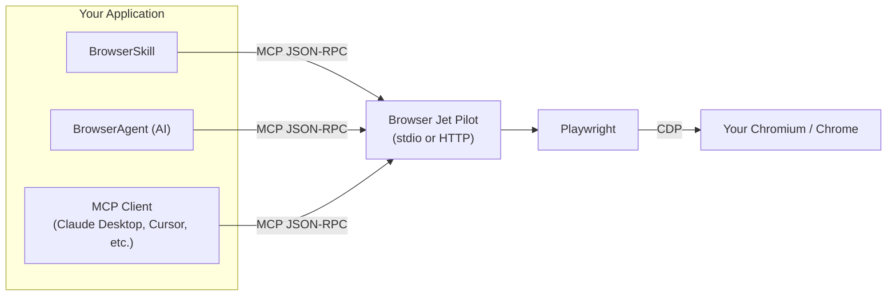

# Browser Jet Pilot

[](https://github.com/0xABADBABE-ops/browser-jet-pilot/actions/workflows/ci.yml)

## Proudly announcing!

### v1.0.1 — Live & Stable 💅

- **API Key Authentication** — secure your HTTP transport with `API_KEY` and `X-API-Key` header
- **Constant-time auth** — `crypto.timingSafeEqual` keeps the bad actors guessing
- **Full test suite** — 127 Vitest tests, zero flakes, CI-green on every push
- **Developer tooling** — ESLint, Prettier, Husky, lint-staged all tuned and humming
- **CI/CD pipeline** — typecheck → lint → format:check → test across Node 20/22/24
- **Shader control tools** — tame those heavy WebGL pages with `browser_disable_shaders`
- **Bug fixes** — SVG/MathML handling, proper browser cleanup, enhanced type safety

### The extras that make it ✨

- **`browser_disable_shaders`** — block WebGL, freeze CSS animations, throttle `requestAnimationFrame` to ~1 FPS. Perfect for those pages that think they're a video game.
- **`browser_restore_shaders`** — bring the sparkle back (WebGL/RAF need a page reload to fully restore, nature of the beast)

## What even is this?

A self-hosted MCP server for browser automation. Connect to your own Chromium via CDP — no subscription, no cloud, no weird per-session pricing. Just your browser, your infra, your rules.

Drop-in alternative to `@browserbasehq/mcp`. Same MCP protocol, none of the lock-in.

## Features

- **Connect to your existing browser** via Chrome DevTools Protocol, or **launch a fresh one** managed by Playwright
- **19 deterministic tools** — no LLM required for basic browser control
- **MCP stdio transport** — works with Claude Desktop, Cursor, any MCP client
- **MCP HTTP transport** — expose as a service with optional API key auth
- **BrowserAgent** — AI-powered autonomous agent (OpenAI, Anthropic, or custom endpoint)
- **BrowserSkill** — standardized skill interface for agent frameworks
- **Multi-tab workflows** — because one tab is never enough
- **Screenshots** — base64 PNG, full-page or single element
- **Comprehensive testing** — 127 tests, Vitest, coverage reports
- **Pre-commit hooks** — ESLint + Prettier gatekeep every commit

## A little notice 🌸

I want you to understand that this repository contains a highly powerful toolset — _exceptionally_ powerful.

It is shared in good faith, with the expectation that you will use these tools responsibly and for educational purposes, without causing harm to others. There are no guardrails, restrictions, or feature flags that would limit or alter their original capabilities.

As the saying goes, _a weapon is only as dangerous as the hands that wield it._ Power itself is neutral — its consequences are defined entirely by the intent and discipline of the user.

I won't go into detail about what could go wrong or the many ways these tools might be misused. If you found this repository while looking for **_that_**, you likely already know what you're doing — and I won't be the one to outline those paths. Instead, below you'll find guidance on how you **should** use these tools, along with the valuable, practical functionality they were designed to provide.

Keep in mind: these tools possess an extraordinary level of power, and that power is entirely in your hands.

If any damage occurs — whether through data leaks, automated actions, replay mechanisms, or otherwise — responsibility does not lie with the tools or this project. The sole accountable party is you. ¯\\\_(ツ)\_/¯

## Quick Start

### 1. Have a browser running with CDP

```bash
# With Xvfb + Chromium:
chromium --no-sandbox --remote-debugging-port=9222 --disable-gpu

# Or point at your existing Chromium (make sure it has --remote-debugging-port=9222)
```

### 2. Install & run

```bash
npm install
npm run build

# Stdio mode (Claude Desktop, Cursor, etc.)
node dist/index.js

# HTTP mode
node dist/index.js --port 3100
```

### 3. Hook it up to Claude Desktop

Drop this into your `claude_desktop_config.json`:

| Platform | Config path                                                       |
| -------- | ----------------------------------------------------------------- |
| macOS    | `~/Library/Application Support/Claude/claude_desktop_config.json` |
| Windows  | `%APPDATA%\Claude\claude_desktop_config.json`                     |
| Linux    | `~/.config/Claude/claude_desktop_config.json`                     |

```json
{
  "mcpServers": {
    "browser": {
      "command": "node",
      "args": ["/absolute/path/to/dist/index.js"],
      "env": {
        "CDP_URL": "http://localhost:9222"
      }
    }
  }
}
```

## Docs (Mintlify)

Project docs live in `docs/` — Mintlify format, cute and functional.

```bash
npm install          # includes Mint CLI as dev dependency
npm run docs:validate  # check it builds clean
npm run docs:links     # no dead links allowed
npm run docs:dev       # browse locally
```

## CI/CD

Every push and PR goes through the wringer. The workflow lives at `.github/workflows/ci.yml`.

```
npm ci → typecheck → lint → format:check → test
```

Across Node 20, 22, and 24 — because we don't mess around. (Node 18 was politely asked to leave the party — vitest v4 needs `styleText` from `node:util`, which landed in 20.12.0.)

## Development

### Scripts at your fingertips

| Command                     | What it does                            |
| --------------------------- | --------------------------------------- |
| `npm run build`             | Compile TypeScript → `dist/`            |
| `npm run dev`               | Dev mode with `tsx` (hot, fast, lovely) |
| `npm start`                 | Run the built server                    |
| `npm run agent`             | BrowserAgent CLI                        |
| `npm run agent:seq`         | Deterministic tool sequence (no AI)     |
| `npm test`                  | Run the full 127-test suite             |
| `npm run test:coverage`     | Tests + coverage report                 |
| `npm run test:ui`           | Vitest UI (pretty!)                     |
| `npm run lint`              | ESLint check                            |
| `npm run lint:fix`          | ESLint auto-fix                         |
| `npm run format`            | Prettier — make it pretty               |
| `npm run format:check`      | Prettier — is it pretty?                |
| `npm run typecheck`         | `tsc --noEmit` type safety check        |
| `npm run reliability:check` | Full reliability test suite             |

### Pre-commit magic

Husky + lint-staged keep the repo pristine:

- `.ts`, `.tsx` → ESLint + Prettier
- `.json`, `.md`, `.yml` → Prettier

```bash
npm install   # hooks set up automatically via the prepare script ✨
```

## Docker

### Compose (the easy way)

```bash
docker compose up -d --build
docker compose ps              # should say healthy 💚
curl http://localhost:3100/healthz
```

What you get:

- MCP endpoint: `http://localhost:3100/mcp`
- Health check: `http://localhost:3100/healthz`
- Built-in container healthcheck against `/healthz`

Quick smoke test:

```bash
npm run agent -- --server-url http://localhost:3100/mcp --sequence \
  browser_start "browser_navigate?url=https://example.com" \
  "browser_get_content?selector=body&type=text" browser_end
```

> First build takes a bit — Playwright Chromium binaries install inside the container. Worth the wait.

Full reliability pass (health + lifecycle + extraction + multi-tab, 5x repeat):

```bash
npm run reliability:check
# or against a custom endpoint:
npm run reliability:check -- http://localhost:3100/mcp
```

### Teardown

```bash
docker compose down
```

### Plain Docker (no Compose)

```bash
docker build -t browser-jet-pilot:local .
docker run --rm -p 3100:3100 --shm-size=1g \
  -e PORT=3100 -e HOST=0.0.0.0 -e LAUNCH=true \
  browser-jet-pilot:local
```

### External Chromium (CDP mode)

```bash
docker run --rm -p 3100:3100 --shm-size=1g \
  -e PORT=3100 -e HOST=0.0.0.0 -e LAUNCH=false \
  -e CDP_URL=http://host.docker.internal:9222 \
  browser-jet-pilot:local
```

On Linux where `host.docker.internal` doesn't resolve:

```bash
--add-host=host.docker.internal:host-gateway
```

## Tools

### Session

| Tool            | Description                                                  |
| --------------- | ------------------------------------------------------------ |
| `browser_start` | Connect to browser (or launch one). Call this first, always. |
| `browser_end`   | Close the current session. Bye-bye!                          |

### Navigation

| Tool                 | Parameters | Description                  |
| -------------------- | ---------- | ---------------------------- |
| `browser_navigate`   | `url`      | Go to a URL                  |
| `browser_new_tab`    | `url?`     | Open a new tab               |
| `browser_list_tabs`  | —          | List all open tabs           |
| `browser_switch_tab` | `index`    | Switch to tab by index       |
| `browser_get_info`   | —          | Current URL, title, viewport |

### Interaction

| Tool             | Parameters                          | Description                 |
| ---------------- | ----------------------------------- | --------------------------- |
| `browser_click`  | `selector`                          | Click an element            |
| `browser_fill`   | `selector`, `value`                 | Clear and fill an input     |
| `browser_type`   | `selector`, `text`, `delay?`        | Type character by character |
| `browser_select` | `selector`, `value`                 | Select a dropdown option    |
| `browser_hover`  | `selector`                          | Hover over an element       |
| `browser_scroll` | `direction`, `amount?`, `selector?` | Scroll page or element      |

### Observation

| Tool                  | Parameters                       | Description                |
| --------------------- | -------------------------------- | -------------------------- |
| `browser_screenshot`  | `fullPage?`, `selector?`         | Screenshot (base64 PNG)    |
| `browser_get_content` | `type?`, `selector?`             | Extract text or HTML       |
| `browser_evaluate`    | `script`                         | Run JavaScript in the page |
| `browser_wait_for`    | `selector`, `state?`, `timeout?` | Wait for an element        |

### Shader Control

| Tool                      | Parameters                      | Description                                                                                                           |
| ------------------------- | ------------------------------- | --------------------------------------------------------------------------------------------------------------------- |
| `browser_disable_shaders` | `webgl?`, `animations?`, `raf?` | Block WebGL, freeze CSS animations, throttle RAF to ~1 FPS. Hit this before navigating to heavy shader pages.         |
| `browser_restore_shaders` | —                               | Remove injected style overrides. WebGL/RAF need a page reload to fully come back — that's just how the browser works. |

## Configuration

### CLI Flags

| Flag                   | Env Var          | Default                 | What it does                               |
| ---------------------- | ---------------- | ----------------------- | ------------------------------------------ |
| `--port <n>`           | `PORT`           | (stdio)                 | Port for HTTP transport                    |
| `--host <host>`        | `HOST`           | `localhost`             | Bind address                               |
| `--cdp-url <url>`      | `CDP_URL`        | `http://localhost:9222` | CDP endpoint                               |
| `--launch`             | `LAUNCH=true`    | `false`                 | Launch a new browser instead of connecting |
| `--browser-width <n>`  | `BROWSER_WIDTH`  | `1280`                  | Viewport width                             |
| `--browser-height <n>` | `BROWSER_HEIGHT` | `720`                   | Viewport height                            |

### Environment

```bash
# .env file
CDP_URL=http://localhost:9222
LAUNCH=false
BROWSER_WIDTH=1280
BROWSER_HEIGHT=720
API_KEY=your-secret-api-key  # optional — locks down HTTP transport
```

### API Key Auth 🔐

When running in HTTP mode, you can optionally gate the server behind an API key:

```bash
export API_KEY=your-secret-api-key
```

Then clients include it in the `X-API-Key` header:

```bash
curl -H "X-API-Key: your-secret-api-key" http://localhost:3100/mcp
```

The server uses `crypto.timingSafeEqual` for constant-time comparison — no timing attacks on our watch.

## Examples

### HTTP Transport

```bash
node dist/index.js --port 3100 --host 0.0.0.0
# → http://0.0.0.0:3100/mcp
# Connect any MCP client via Streamable HTTP transport
```

### Launch Mode

No browser lying around? Let Playwright handle it:

```bash
node dist/index.js --launch --browser-width 1920 --browser-height 1080
```

## How it stacks up to Browserbase MCP

| Feature                  | Browserbase MCP     | Browser Jet Pilot                            |
| ------------------------ | ------------------- | -------------------------------------------- |
| Browser hosting          | Browserbase cloud   | Your container 💕                            |
| Cost                     | Per-session pricing | Free (your infra)                            |
| `act` (natural language) | Stagehand + LLM     | Use deterministic tools or BrowserAgent      |
| `observe`                | Stagehand + LLM     | `browser_get_content` + `browser_screenshot` |
| `extract`                | Stagehand + LLM     | `browser_evaluate` + `browser_get_content`   |
| Screenshot               | Via Stagehand       | Native `browser_screenshot`                  |
| Tab management           | Single page         | Multi-tab ✨                                 |
| Data residency           | Browserbase servers | Your server, your data                       |

## Architecture



## BrowserAgent (AI-Powered) 🤖

An autonomous agent that hooks into the MCP server and uses an LLM to figure out what tools to call, in what order, to accomplish your natural language task.

### CLI

```bash
# AI-powered (needs OPENAI_API_KEY or ANTHROPIC_API_KEY)
npm run agent -- --server-url http://localhost:3100/mcp \
  "Go to start.gg and find the latest Tekken 7 tournament"

# Anthropic flavor
npm run agent -- --server-url http://localhost:3100/mcp \
  --ai-provider anthropic --ai-model claude-sonnet-4-20250514 \
  "Navigate to example.com and extract all links"

# Deterministic mode (no AI, straight tool sequence)
npm run agent -- --server-url http://localhost:3100/mcp --sequence \
  browser_start \
  "browser_navigate?url=https://example.com" \
  browser_screenshot \
  browser_end
```

### Programmatic

```typescript
import { BrowserAgent } from 'browser-jet-pilot/agent'

const agent = new BrowserAgent({
  serverUrl: 'http://localhost:3100/mcp',
  aiProvider: 'openai',
  aiModel: 'gpt-4o',
  // aiApiKey: 'sk-...',  // or set OPENAI_API_KEY
  maxSteps: 20,
})

// AI-powered task
const result = await agent.run(
  'Go to start.gg/tournament/12345 and get the bracket'
)
console.log(result.summary)
console.log(
  `Steps: ${result.steps.length}, Screenshots: ${result.screenshots.length}`
)

// Deterministic sequence
const result2 = await agent.executeSequence([
  { tool: 'browser_start' },
  { tool: 'browser_navigate', args: { url: 'https://example.com' } },
  { tool: 'browser_screenshot' },
])

await agent.disconnect()
```

### Agent Config

| Option          | Env Var          | Default               | What it does               |
| --------------- | ---------------- | --------------------- | -------------------------- |
| `serverUrl`     | —                | —                     | MCP server HTTP endpoint   |
| `serverCommand` | —                | `node`                | MCP server command (stdio) |
| `serverArgs`    | —                | `['./dist/index.js']` | MCP server args (stdio)    |
| `aiProvider`    | —                | `openai`              | `openai` or `anthropic`    |
| `aiModel`       | —                | `gpt-4o`              | LLM model name             |
| `aiApiKey`      | `OPENAI_API_KEY` | —                     | Your API key               |
| `aiBaseUrl`     | —                | provider default      | Custom endpoint            |
| `maxSteps`      | —                | `30`                  | Safety limit per task      |

## BrowserSkill (Agent Framework Integration) 🧩

A standardized skill wrapper ready to drop into any agent framework. Comes with quick helper methods and automatic screenshot saving.

### Programmatic

```typescript
import { BrowserSkill } from 'browser-jet-pilot/skill'

const skill = new BrowserSkill({
  serverUrl: 'http://localhost:3100/mcp',
  saveScreenshots: true,
  screenshotDir: './screenshots',
})

await skill.init()

// AI-powered browser task
const result = await skill.execute(
  'Go to start.gg and extract tournament data',
  { workDir: './workspace' }
)
console.log(result.summary) // "Found 3 tournaments..."
console.log(result.files) // ['./screenshots/step-3-1712...png']
console.log(result.metadata) // steps, duration, tool calls

// Quick helpers (deterministic, no AI needed)
const page = await skill.goto('https://example.com')
const content = await skill.read('https://example.com', '#main-content')
const { base64, file } = await skill.capture('https://example.com', true)
const links = await skill.extract(
  'https://example.com',
  'Array.from(document.querySelectorAll("a")).map(a => ({text: a.innerText, href: a.href}))'
)

await skill.destroy()
```

### Skill Interface

```typescript
interface SkillResult {
  success: boolean
  summary: string
  files: string[] // saved screenshot paths
  data?: any // parsed JSON from last step
  metadata: {
    steps: number
    screenshots: number
    totalDuration: number
    toolCalls: Array<{ tool: string; args: Record<string, unknown> }>
  }
}
```

## Requirements

- Node.js >= 20.12.0
- Chromium with `--remote-debugging-port=9222` (or launch mode)
- For Playwright browser launch: `npx playwright install chromium`

## License

MIT

designed, written and coded solely by head and from 💜 for you `0xabadbabe` (Sudo Qt — jet'aime)
