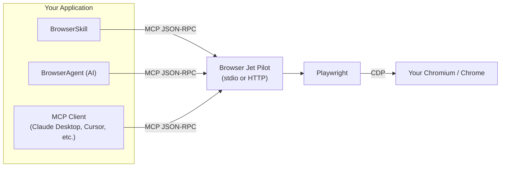

## System flow

## Notes

- `BrowserSkill` is the stable integration layer for framework-driven execution.
- `BrowserAgent` adds optional LLM planning on top of deterministic tools.
- Any MCP-compatible client can call the same tool surface through `/mcp` (HTTP) or stdio.
- Browser control always resolves to Playwright + CDP, so runtime behavior is consistent across integration modes.

