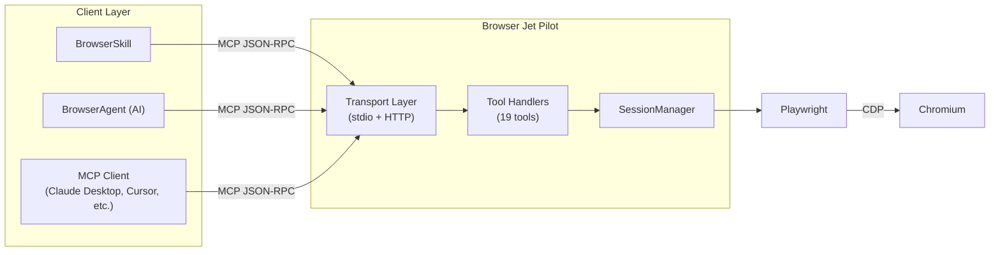
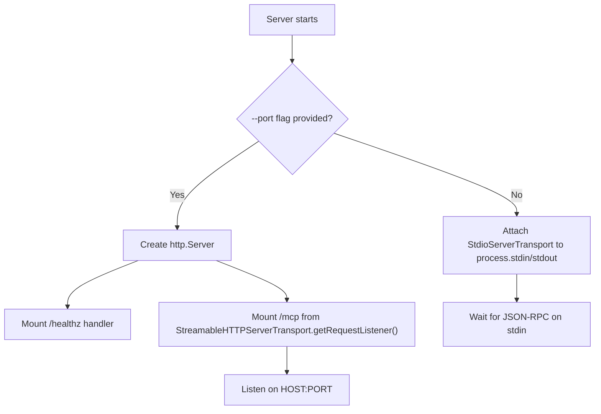
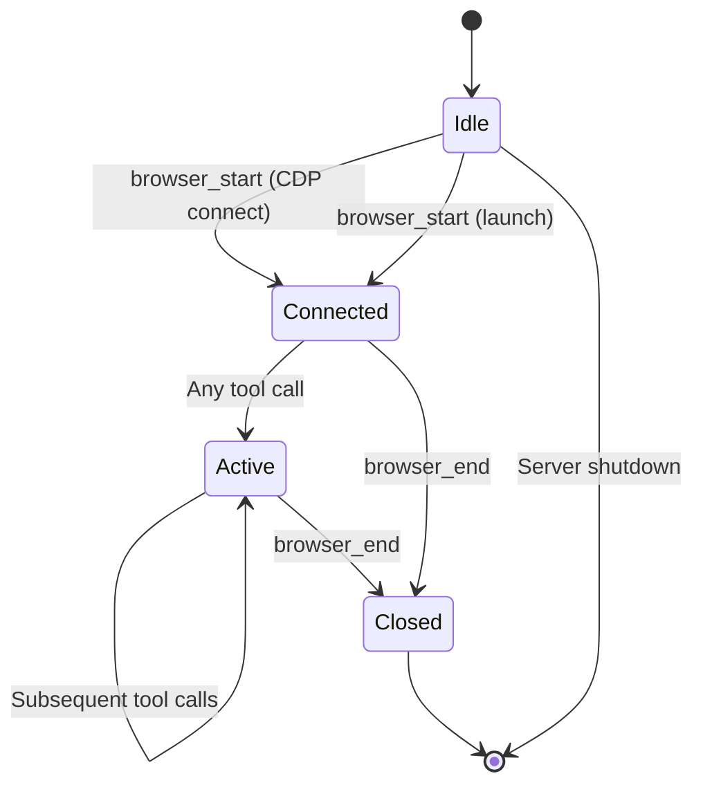
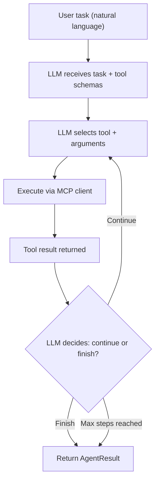
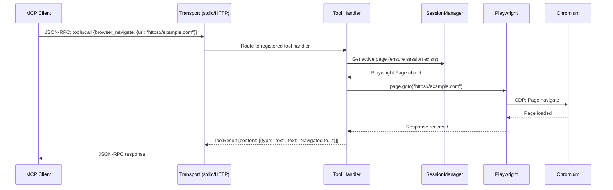

## High-level overview

Browser Jet Pilot is a single-process Node.js application that exposes browser automation tools through the Model Context Protocol (MCP). Every browser action resolves to Playwright issuing commands over Chrome DevTools Protocol (CDP) to a Chromium instance — regardless of which client initiated the request.



---

## Transport layer

The server supports two MCP transport modes, selected at startup:

### Stdio transport

Used by desktop MCP clients (Claude Desktop, Cursor, Windsurf, Cline). The server reads JSON-RPC messages from stdin and writes responses to stdout. This is the default when no `--port` flag is provided.

The server process is spawned by the client as a child process. No network ports are opened.

### HTTP transport (Streamable HTTP)

Activated with `--port <n>`. The server creates a `http.Server` and mounts the MCP request listener from `StreamableHTTPServerTransport.getRequestListener()` at the `/mcp` path. A health check endpoint is exposed at `/healthz`.

When `API_KEY` is set, every request to `/mcp` must include a matching `X-API-Key` header. Comparison uses `crypto.timingSafeEqual` to prevent timing attacks.

```
POST /mcp              → MCP JSON-RPC request handler
GET  /healthz           → {"status":"ok","service":"browser-jet-pilot","transport":"http"}
```

### Transport selection flow



---

## Session management

`SessionManager` (in `src/session.ts`) owns the browser lifecycle. It handles two connection modes:

### CDP connect mode (default)

When `LAUNCH=false` (default), SessionManager connects to an already-running Chromium via `playwright.chromium.connectOverCDP(cdpUrl)`. This attaches to the browser's existing debugging port — the browser was started with `--remote-debugging-port=9222`.

This is the preferred mode for Docker deployments and long-running setups where Chromium is managed separately (e.g., by systemd, Xvfb, or a VNC container).

### Launch mode

When `LAUNCH=true`, SessionManager calls `playwright.chromium.launch()` to spawn a fresh browser instance. Playwright manages the full lifecycle. This mode is useful for quick testing and environments without a pre-running browser.

### Session lifecycle



- `browser_start` is idempotent — calling it on an active session returns the existing connection
- `browser_end` closes the Playwright browser context and resets the session
- The session persists between tool calls within the same client connection

---

## Tool surface

All 19 tools are registered via `McpServer.registerTool()` with Zod input schemas. They are grouped into four categories:

### Session (2 tools)

| Tool | Purpose |
|------|---------|
| `browser_start` | Initialize the browser session. Must be called first. |
| `browser_end` | Close the browser session and release resources. |

### Navigation (5 tools)

| Tool | Purpose |
|------|---------|
| `browser_navigate` | Navigate to a URL. |
| `browser_new_tab` | Open a new browser tab, optionally with a URL. |
| `browser_list_tabs` | Return all open tabs with index, title, and URL. |
| `browser_switch_tab` | Focus a tab by its index. |
| `browser_get_info` | Return the current page's URL, title, and viewport dimensions. |

### Interaction (6 tools)

| Tool | Purpose |
|------|---------|
| `browser_click` | Click a DOM element by CSS selector. |
| `browser_fill` | Clear an input field and set its value directly. |
| `browser_type` | Simulate keyboard input character by character with optional delay. |
| `browser_select` | Pick a `<select>` dropdown option by value. |
| `browser_hover` | Move the mouse over an element. |
| `browser_scroll` | Scroll the page or a specific element in a direction. |

### Observation (4 tools)

| Tool | Purpose |
|------|---------|
| `browser_screenshot` | Capture a PNG screenshot (viewport or full-page, optional element selector). |
| `browser_get_content` | Extract text or HTML from the page or a selector. |
| `browser_evaluate` | Execute arbitrary JavaScript in the browser context. |
| `browser_wait_for` | Wait for a selector to reach a state (attached, visible, hidden) or a timeout. |

### Shader control (2 tools)

| Tool | Purpose |
|------|---------|
| `browser_disable_shaders` | Block WebGL context creation, freeze CSS animations, throttle RAF to ~1 FPS. |
| `browser_restore_shaders` | Remove injected overrides. WebGL/RAF need a page reload to fully restore. |

---

## Agent orchestration

### BrowserAgent

`BrowserAgent` (in `src/agent/BrowserAgent.ts`) is an LLM-driven loop that plans and executes browser tasks:



The agent connects to the MCP server either via HTTP (to a running server instance) or by spawning the server process directly via stdio. It queries the server's tool list, constructs a system prompt with all tool schemas, and enters a loop where the LLM selects the next tool call based on accumulated results.

Each step is logged with the tool name, arguments, result text, and duration. Screenshots are collected as base64 strings. The final result includes a natural-language summary generated by the LLM.

The agent supports a synthetic `finish` tool — when the LLM determines the task is complete, it calls `finish` with a summary, breaking the loop cleanly.

### BrowserSkill

`BrowserSkill` (in `src/skill/BrowserSkill.ts`) wraps BrowserAgent with a standardized interface for agent frameworks. It adds:

- **Automatic screenshot persistence** — screenshots are saved as PNG files to a configurable directory
- **Structured data extraction** — tool results that parse as JSON are returned in the `data` field
- **Helper methods** — `goto()`, `read()`, `capture()`, `extract()` for common operations without AI planning

### Deterministic mode

Both BrowserAgent (via `--sequence`) and BrowserSkill helpers bypass the LLM entirely. Tool calls are executed in a fixed order, making them reproducible and suitable for CI pipelines and reliability testing.

---

## Data flow: a complete request

Here's what happens when a client calls `browser_navigate?url=https://example.com`:



---

## Security model

The security architecture is documented in detail in the repository's `SECURITY.md` and `SECURITY_REVIEW_REPORT.md`. Key points:

- **No code execution by default** — tools perform browser operations, not arbitrary system commands. The exception is `browser_evaluate`, which runs JavaScript in the browser context, not the server context.
- **HTTP auth** — optional `API_KEY` with constant-time comparison prevents unauthorized access to the HTTP transport.
- **No credential storage** — the server holds no user data, cookies, or credentials. Browser state lives in Chromium's process, not in the server.
- **Network boundary** — in CDP connect mode, the server only connects to a specified CDP endpoint. In launch mode, Playwright manages the browser's network access.
- **Dependency audit** — all dependencies are pinned and reviewed. The project uses npm's lockfile for reproducible builds.

---

## File structure

```
browser-jet-pilot/
├── src/
│   ├── index.ts              # Server entry — transport setup, tool registration
│   ├── config.ts             # Zod-validated environment config
│   ├── session.ts            # SessionManager — browser lifecycle
│   ├── types.ts              # Shared TypeScript interfaces
│   ├── tools/
│   │   └── index.ts          # All 19 tool registrations
│   ├── agent/
│   │   ├── BrowserAgent.ts   # AI-driven browser agent
│   │   ├── cli.ts            # Agent CLI entry point
│   │   └── index.ts          # Re-exports
│   └── skill/
│       ├── BrowserSkill.ts   # Standardized skill interface
│       ├── browser-skill.json # Skill manifest
│       └── index.ts          # Re-exports
├── docs/                     # Mintlify documentation
│   ├── docs.json             # Navigation config
│   ├── getting-started/      # Installation, quickstart, Docker
│   ├── guides/               # Agent/skill, integrations, reliability
│   ├── reference/            # Architecture, config, endpoints, tools
│   └── development/          # Testing, linting, contributing
├── scripts/
│   └── reliability-check.sh  # End-to-end reliability test suite
├── .github/workflows/ci.yml  # CI pipeline
├── Dockerfile                # Container build
├── docker-compose.yml        # One-command deployment
├── AGENTS.md                 # AI agent contribution instructions
├── SECURITY.md               # Security policy
└── package.json              # v1.0.1, ESM, exports map
```